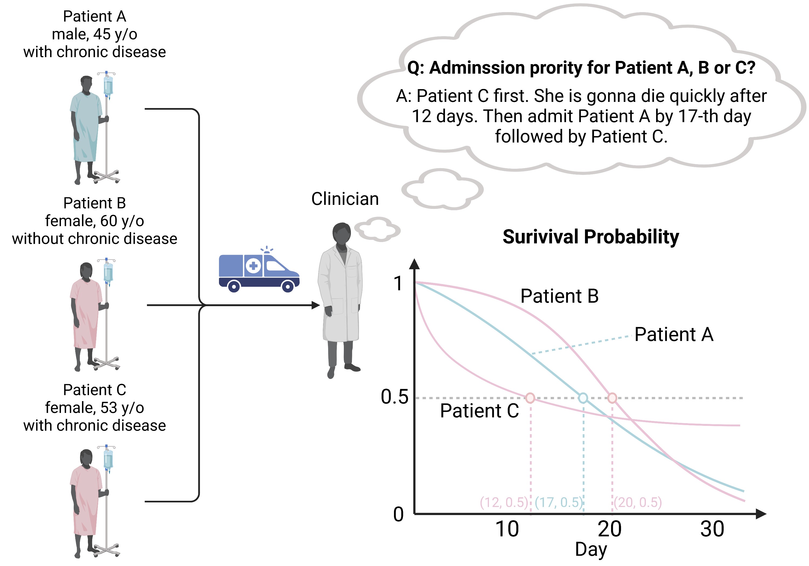

# COVID-19 ISDEvaluation
This repository will contain the codes and datasets we used for our paper "Learning Accurate Personalized Survival Models for Predicting Hospital Discharge and Mortality of COVID-19 Patients", which is currently under review in the Nature Scientific Reports. 

## We commit to release all the codes and the datasets used in above paper in this repository after the publication of our paper.

The graphical abstract of our paper is shown below:

## Contributors

- Li-Hao Kuan (lihao@ualberta.ca)
- Shi-ang Qi (shiang@ualberta.ca)
- Neeraj Kumar (neeraj4@ualberta.ca)
- Weijie Sun (weijie2@ualberta.ca)
- Jianfie Zhang (jianfie3@ualberta.ca)
- Russell Greiner (rgreiner@ualberta.ca)

If you have any questions regarding individual survival predictions, please do not hesitate to contact us.

Meanwhile you can look at the [ISDEvaluation codes](https://github.com/haiderstats/ISDEvaluation) associated with the paper titled [Effective Ways to Build and Evaluate Individual Survival Distributions](https://www.jmlr.org/papers/volume21/18-772/18-772.pdf) published in the Journal of Machine Learning Research in 2020. We adapted the aforementioned code for our survival prediction tasks and also added several functions that were specific to our COVID-19 personalized survival estimation. 
